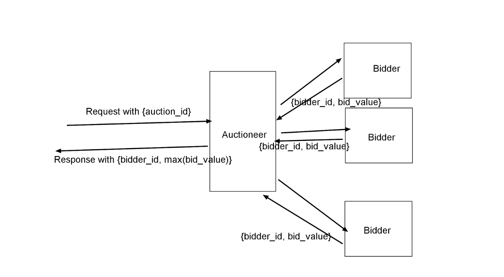

# bidding

Ad Request Auction System

Create an auction system which can auction bids and select the winning bid such that it always responds before a specific time interval.

Demo link: https://www.loom.com/share/b8213e38c14841bbbe7f7ebf74a2ab81

Postman Collection: https://www.getpostman.com/collections/9a77db9a47732a9f454e



```
make build-server
docker-compose up --build

docker-compose down --remove-orphans
```

There would be following actors in the system

### Key terms:

**1. Auction ID** - Unique identifier for an auction round.

**2. Bid Amount** - Floating numerical value of the bid amount.

**3. Ad Request** - JSON with key of “auction_id”

**4. Ad Response** - JSON with key of “price”, “bidder_id”

**5. Bidder** - There would be specific numbers of bidders, which would respond to the bid request of the auctioneer with Ad Response from which auctioneer will determine winner of bid round, Bidder need to respond to the bid request with some amounts of delay ( generally 10ms to 500 ms).

Bidder system should accept following configuration parameters.

(i) Delay time in ms

(ii) Port to bind as input

(iii) URL to register itself with auctioneer

**6. Auctioneer** - This is the main coordinator responsible for carrying out the bid rounds. At the start of each bid round this will take an ad request which would contain auction_id, which is the identifier of a bid round (random string). Whenever auctioneer receives a bid request, it will conduct a bid round, where it will query all the bidders for the auction. They will respond to the request with the above described behaviour and auctioneer will choose the highest bidder within 200ms and respond to the incoming request with an ad response. If no response is available from any bidder (they all decided to take more than 200ms for a request), send an appropriate HTTP status code.
Auctioneer should expose following endpoints

(i) Bid endpoint - This is where ad requests will be coming in.

(ii) List endpoint - This endpoint will give registered endpoints.

(iii) Registration Endpoint - This endpoint will be used to bidder to register itself to the bidder once it’s online.

All the communication between the parties is expected to be in the form of HTTP requests.

Write a program in any programming language that can simulate the above behaviour, dockerize the application and include a docker compose file. Bidder should be manageable with docker compose file. Once the auctioneer is online it should keep track of registered bidders. When any bidder comes online, it should register itself to the auctioneer and wait for bid requests.
